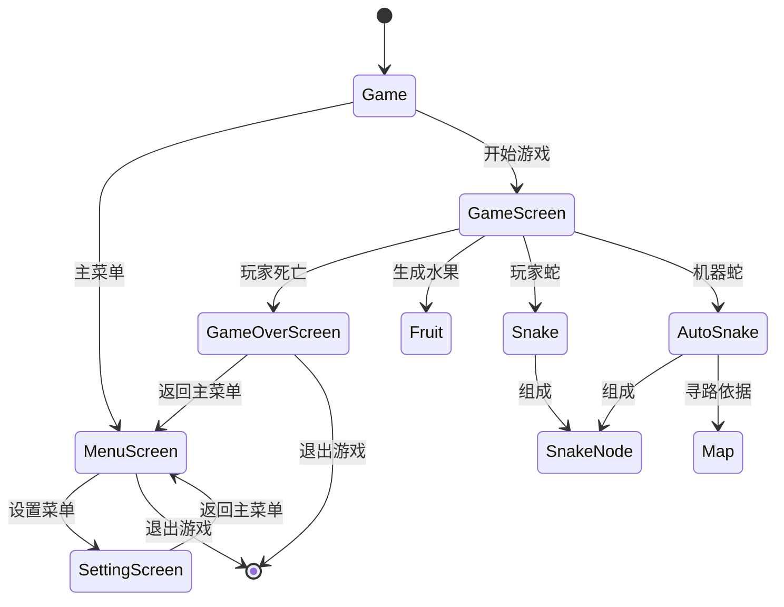
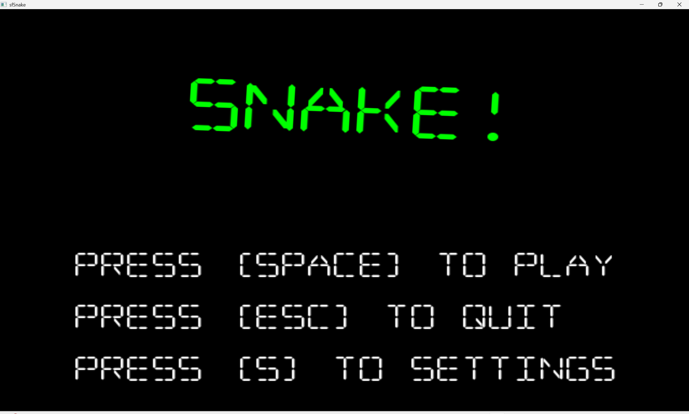
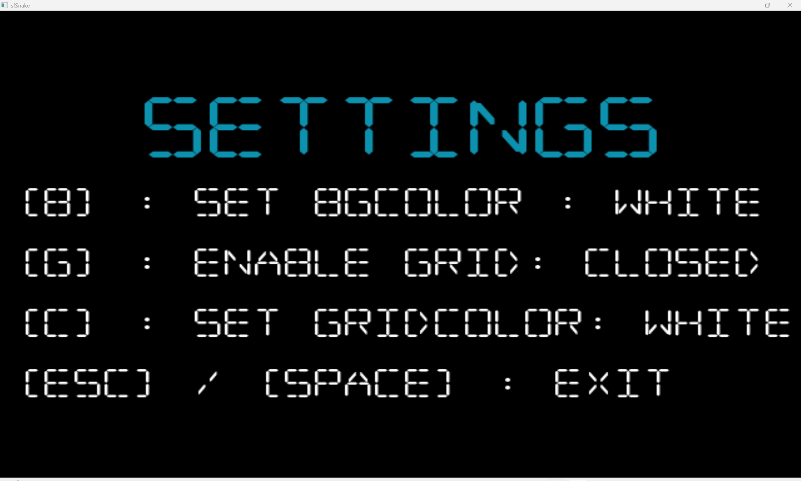
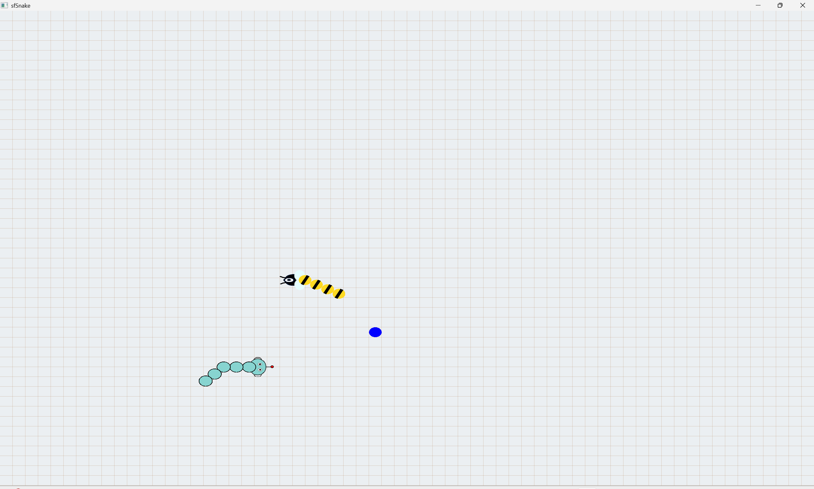
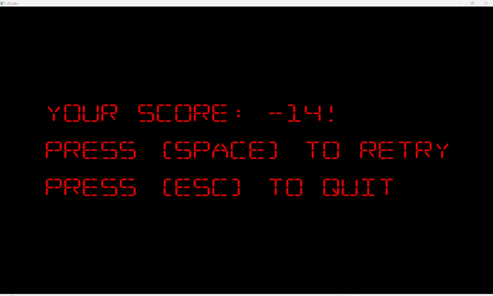

# OOP 课程项目 贪吃蛇 说明文档
  
**作者**：李维杰  
**日期**：2025年5月31日

---

## 编译环境
- `Windows 11 ` 
- `GCC 13.0.1`
- `-std=c++17`
- `SFML 2.6.2`

--- 

## 背景介绍

本项目完善了一个既有的贪吃蛇游戏，为其增加了一些新的功能，提高了游戏的可玩性。具体新增的功能如下：

-   增加一个由电脑控制的蛇与玩家竞争。
    -   机器蛇的寻路算法是**带剪枝的A***，旨在以最快的速度吃到水果。
    -   新的游戏模式下，玩家的得分为**玩家操控的贪吃蛇长度 - 电脑操控的贪吃蛇长度**。
-   改善贪吃蛇的控制模式。
    -   玩家可以通过`↑、↓、←、→`或`W、S、A、D`操控贪吃蛇的移动。
    -   玩家可以通过鼠标点击目标位置，控制贪吃蛇朝任意方向移动。
-   增加水果的种类。系统新增 5 种水果，每种水果的颜色、效果和生成比例如下表所示：

    | 水果颜色 | 长度增加 | 效果说明               | 生成概率 | 累计概率 |
    |---------|----------|-----------------------|----------|----------|
    | 黑色    | +0       | 不增加长度             | 12.5%    | 12.5%    |
    | 棕色    | +0       | 不增加长度             | 12.5%    | 25.0%    |
    | 红色    | +3       | 大幅增加长度           | 25.0%    | 50.0%    |
    | 蓝色    | +2       | 中等增加长度           | 25.0%    | 75.0%    |
    | 绿色    | +1       | 小幅增加长度           | 25.0%    | 100.0%   |

-   修改贪吃蛇皮肤。
    -   玩家操控贪吃蛇的皮肤为**蜜蜂**。
    -   电脑操控贪吃蛇的皮肤为**机器人**。
-   增加整体界面的自定义设置。
    -   允许修改背景颜色（白色、黑色、褐色）。
    -   允许开关网格线，允许修改网格线颜色（白色、黑色、褐色）。

## 算法解释

-   游戏过程中的每一帧均会执行以下操作
    ```cpp
    handleInput();
	update(TimePerFrame);
    ```
    以上两个函数均为定义在基类`Game`中的纯虚函数，在游戏进程中由派生类`GameScreen`实现具体的功能，即捕捉玩家的操作，并更新渲染游戏图像。

    更具体地，在`update`过程包含以下操作
    ```cpp
    // 补充生成水果
    if (fruit_.size() == 0) generateFruit();

    // 更新地图（用于机器蛇寻路）
    map_.clear(); map_.build();

    // 更新两只蛇的位置
    snake_.update(delta);
    autoSnake_.update(delta, map_, fruit_);

    // 判断是否吃到水果
    snake_.checkFruitCollisions(fruit_); 
    autoSnake_.checkFruitCollisions(fruit_);

    // 判断游戏结束
    if (snake_.hitSelf() || MankindHead.getBounds().intersects(RobotNode.getBounds()))
		Game::Screen = std::make_shared<GameOverScreen>(snake_.getSize() - autoSnake_.getSize(), bgColor_, showGrid_, gridColor_);
    ```
-   机器蛇的寻路采用A*算法，旨在尽快吃到水果。核心代码如下：
    ```cpp
    while (!open.empty()) {
        Node curr = open.top(); open.pop();
        if ((curr.x == goal.x && curr.y == goal.y) || curr.g >= 5) { 
            // 为了提高搜索效率，由于障碍（蛇）的数量较少，故当搜索到与起点距离超过5的点即可视为找到下一步方向。
            std::vector<sf::Vector2i> path;
            Node* p = &curr;
            while (p) {
                path.push_back(sf::Vector2i(p->x, p->y));
                p = p->parent;
            }
            std::reverse(path.begin(), path.end());
            return path;
        }
        closed.insert({curr.x, curr.y});
        static const int dx[8] = {0,0,1,-1,1,1,-1,-1}, dy[8] = {1,-1,0,0,1,-1,1,-1};
        for (int d = 0; d < 8; ++d) {
            int nx = curr.x + dx[d], ny = curr.y + dy[d];
            if (nx < 0 || ny < 0 || nx >= w || ny >= h) continue;
            if (map.isObstacle(nx, ny)) continue;
            if (closed.count({nx, ny})) continue;
            float ng = curr.g + ((d < 4) ? 1.f : 1.414f);
            float nh = std::hypot(goal.x - nx, goal.y - ny);
            Node* next = new Node(nx, ny, ng, nh, new Node(curr.x, curr.y, curr.g, curr.h, curr.parent));
            open.push(*next);
            allNodes[{nx, ny}] = next;
        }
    }
    return {}; // 无路可走
    ```

##  核心部分流程图

##  效果展示

### 编译环境

-   见说明文档开头处。

### 运行界面展示

-   开始菜单界面（`[SPACE]` : 开始游戏；`[ESC]` : 退出；`[S]` : 前往设置菜单界面）：

 

-   设置菜单界面（`[B]` : 切换背景颜色；`[G]` : 切换网格线开关状态；`[C]` : 切换网格线颜色；`[ESC]`/`[SPACE]`：推出设置菜单界面）：

 

-   游戏界面（通过`↑、↓、←、→`或`W、S、A、D`操控贪吃蛇的移动）：

 

-   游戏结算界面（`[SPACE]` : 回到开始界面；`[ESC]` : 退出游戏）：

 

### 视频链接

https://www.bilibili.com/video/BV1YL7NzbEgU/?spm_id_from=333.1387.list.card_archive.click&vd_source=48d005c7bdc06745d963e89f277278c9

###  原始代码链接

本项目改编自：https://github.com/jhpy1024/sfSnake
